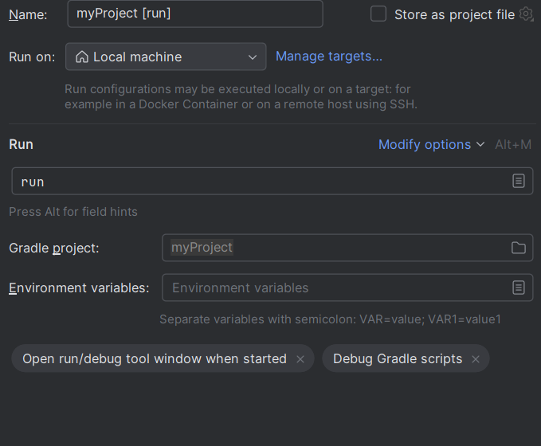

# angry-birds
This contains the project for course CSE-201 (Advanced Programming). In this we have made the angry-birds game.

1. clone the repository
 
2. set the root as idea project
 
3. set gradle configuration as:
  
  

click on run

repo: https://github.com/vidush11/angry-birds
